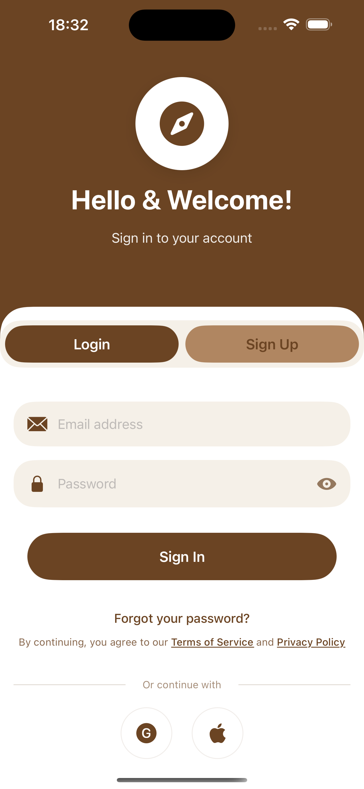

# Unfold 🗺️

> Turn your real-world travels into an adventure. Explore the world and reveal the map as you go.

[](https://developer.apple.com/ios/)
[](https://swift.org)
[](LICENSE)
[](https://developer.apple.com/xcode/swiftui/)

Unfold is an iOS app that gamifies real-world exploration by revealing a fog-covered map as you travel. Like classic exploration games, the world starts hidden and gradually unveils itself as you venture into new places.

## 📱 Screenshots

<div align="center">
  
  
  
  
</div>

> **Note**: To add screenshots, run the app in Xcode simulator, capture screens (⌘+S), and save them to a `screenshots/` folder.

## ✨ Features

### 🔐 Authentication
- Email/password authentication
- Social login (Google, Apple - coming soon)
- Secure password reset flow with deep linking
- Session management with Supabase Auth

### 🗺️ Map & Exploration
- Real-time GPS location tracking
- Interactive map centered on user location
- Zoom controls (+/-) for map navigation
- Location permission handling

### 🎮 Gamification (Coming Soon)
- Fog of war/exploration overlay
- Grid-based exploration tracking
- Progress statistics and achievements
- Exploration percentage tracking

### 🎨 Modern UI/UX
- Clean, minimalist design with brown/tan theme
- Smooth animations and transitions
- Frosted glass effects (iOS native materials)
- Responsive layout for all iPhone sizes

## 🏗️ Architecture

Unfold follows **pure MVC (Model-View-Controller)** architecture with a focus on:

- **Clean separation of concerns**
- **Fat controllers** that handle all business logic
- **Lightweight models** for data structures only
- **Pure UI views** with no business logic
- **SOLID principles** throughout the codebase

```
Unfold/
├── Model/          # Data structures
├── View/           # SwiftUI screens and components
├── Controller/     # Business logic and state management
└── Shared/         # Reusable components and utilities
```

For detailed architecture information, see [ARCHITECTURE.md](ARCHITECTURE.md).

## 🛠️ Tech Stack

- **Language**: Swift 5.9+
- **UI Framework**: SwiftUI
- **Backend**: [Supabase](https://supabase.com) (Auth, Database)
- **Maps**: Apple MapKit
- **Location**: CoreLocation
- **Dependencies**: Swift Package Manager

### Key Dependencies

- [supabase-swift](https://github.com/supabase/supabase-swift) (v2.36.0) - Backend authentication
- Apple Swift packages: swift-crypto, swift-http-types, swift-clocks

## 🚀 Getting Started

### Prerequisites

- Xcode 15.0 or later
- iOS 16.0+ deployment target
- Supabase account ([sign up free](https://supabase.com))

### Installation

1. **Clone the repository**
   ```bash
   git clone https://github.com/RostislavUlinets/Unfold.git
   cd Unfold
   ```

2. **Set up Supabase credentials**
   ```bash
   cp .env.example .env
   ```

   Edit `.env` and add your credentials:
   ```bash
   SUPABASE_URL=https://your-project.supabase.co
   SUPABASE_KEY=your-supabase-anon-key
   ```

3. **Run the Supabase migration** (optional - for future fog features)
   - Open your Supabase project dashboard
   - Go to SQL Editor
   - Run the migration in `supabase_migration_explored_cells.sql`

4. **Open the project in Xcode**
   ```bash
   open Unfold.xcodeproj
   ```

5. **Build and run**
   - Select a simulator or connected device
   - Press ⌘+R to build and run

### Configuration

The app loads Supabase credentials from:
1. Environment variables (`.env` file)
2. Info.plist dictionary values (fallback)

Location permissions are configured in `Info.plist`:
- `NSLocationWhenInUseUsageDescription` - Required for location tracking

## 🧪 Testing

[](https://github.com/RostislavUlinets/Unfold/actions/workflows/test.yml)
[](https://codecov.io/gh/RostislavUlinets/Unfold)

Unfold has comprehensive unit test coverage with **156 tests** covering utilities, validators, models, and controllers.

### Test Coverage

- **✅ 91 tests** - Utilities & Validators (EmailValidator, PasswordValidator, DeepLinkParser)
- **✅ 14 tests** - Model Layer (User model with computed properties)
- **✅ 30 tests** - AuthController (validation logic, state management)
- **✅ 18 tests** - LocationController (location tracking, state management)
- **✅ 13 tests** - PasswordResetController (email validation, error handling)
- **✅ 33 tests** - PasswordResetConfirmationController (password validation, computed properties)

### Running Tests

```bash
# Run all unit tests
xcodebuild test -scheme Unfold -destination 'platform=iOS Simulator,name=iPhone 15' -only-testing:UnfoldTests

# Run specific test file
xcodebuild test -scheme Unfold -destination 'platform=iOS Simulator,name=iPhone 15' -only-testing:UnfoldTests/EmailValidatorTests

# Run with code coverage
xcodebuild test -scheme Unfold -destination 'platform=iOS Simulator,name=iPhone 15' -enableCodeCoverage YES

# Run UI tests (when available)
xcodebuild test -scheme Unfold -only-testing:UnfoldUITests
```

### Continuous Integration

All pull requests and commits to `main` automatically run:
- ✅ Full unit test suite
- ✅ Code coverage reporting
- ✅ SwiftLint code quality checks

See [.github/workflows/test.yml](.github/workflows/test.yml) for CI configuration.

### Test Structure

```
UnfoldTests/
├── Utilities/          # Utility class tests (validators, parsers)
├── Model/             # Model layer tests (User, etc.)
├── Controller/        # Controller tests (Auth, Location, etc.)
└── Helpers/           # Test helpers and constants
```

### Writing Tests

Tests use the modern Swift Testing framework with `@Test` annotations:

```swift
@Test("Email validator accepts valid emails")
func validEmail_returnsTrue() {
    #expect(EmailValidator.isValid("user@example.com") == true)
}
```

For testing best practices, see [TESTING.md](TESTING.md).

## 📖 Development

### Building

```bash
# Debug build
xcodebuild -scheme Unfold -configuration Debug build

# Release build
xcodebuild -scheme Unfold -configuration Release build

# Clean build artifacts
xcodebuild -scheme Unfold clean
```

### Code Style

This project follows strict clean code principles:
- Files limited to 100-150 lines
- Single responsibility per file/class
- KISS (Keep It Simple and Short)
- Clear, self-documenting code

See [DEVELOPMENT_GUIDELINES.md](DEVELOPMENT_GUIDELINES.md) for detailed guidelines.

### Working with Claude Code

This project includes Claude Code instructions in [CLAUDE.md](CLAUDE.md). When using Claude Code:
- The AI assistant follows MVC patterns automatically
- Maintains consistent code style
- Respects file size limits and SOLID principles

## 🗺️ Roadmap

- [x] User authentication (email/password)
- [x] Password reset with deep linking
- [x] Real-time location tracking
- [x] Interactive map view
- [ ] Fog of exploration overlay
- [ ] Grid-based exploration tracking
- [ ] Social login (Google, Apple)
- [ ] Exploration statistics
- [ ] Achievement system
- [ ] Share exploration progress
- [ ] Dark mode support

## 🤝 Contributing

Contributions are welcome! Please follow these steps:

1. Fork the repository
2. Create a feature branch (`git checkout -b feature/amazing-feature`)
3. Follow the code style guidelines in [DEVELOPMENT_GUIDELINES.md](DEVELOPMENT_GUIDELINES.md)
4. Commit your changes (`git commit -m 'feat: Add amazing feature'`)
5. Push to the branch (`git push origin feature/amazing-feature`)
6. Open a Pull Request

### Commit Convention

This project uses conventional commits:
- `feat:` - New features
- `fix:` - Bug fixes
- `refactor:` - Code refactoring
- `docs:` - Documentation updates
- `test:` - Test additions/updates
- `perf:` - Performance improvements

## 📄 License

This project is licensed under the MIT License - see the [LICENSE](LICENSE) file for details.

## 👨‍💻 Author

**Rostyslav Ulynets**

- GitHub: [@RostislavUlinets](https://github.com/RostislavUlinets)

## 🙏 Acknowledgments

- Built with [SwiftUI](https://developer.apple.com/xcode/swiftui/)
- Backend powered by [Supabase](https://supabase.com)
- Developed with assistance from [Claude Code](https://claude.com/claude-code)

---

<div align="center">
  Made with ❤️ using SwiftUI
</div>
